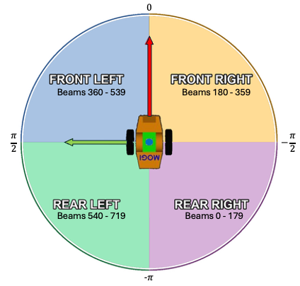

<a name="readme-top"></a>
<div align="center">
  <h1 align="center">Robot programming with ROS</h1>
  <h3 align="center">Elisa Foderaro</h3>
</div>

This repository contains my solution to the assignment of the RPR 2026 course.

The task was to implement a ROS 2 package for a simulated differential drive robot (the `mogi_bot` of the `bme_gazebo_sensors` package) that, given the provided simulation environment:
1. allows the user to drive the robot around, by setting a linear and angular velocity
2. if the user's input causes the robot to be "too close" to one of the obstacles (e.g., the minimum value of the laser scanner is below a certain threshold), moves the robot back to the previous position, to remain in a safe area
3. allows the user to change the threshold, by means of a ROS service
4. publishes on a topic a custom message with the distance of the closest obstacle, the direction of the obstacle (e.g., left, front, right) and the threshold
5. allows the user to get the average linear and angular velocity of the most recent 5 inputs, by means of another ROS service

# My implementation
The robot is a differential drive robot equipped with a 2D lidar. Consequently, the topics of interest for my project are:
- `/cmd_vel` (`geometry_msgs/msg/Twist`), the velocity command the robot executes
- `/scan` (`sensor_msgs/msg/LaserScan`), the measurements of the lidar

## Summary
The solution is split into two packages.

`driving_robot` contains the nodes implemented for this assignment, all written in C++:
- `drive_robot` turns the input of the user into velocity commands and stops the robot before it hits something
- `obstacle_monitor` reads the lidar, reports the closest obstacle of each sector (see [Safety behavior](#2-safety-behavior)) and exposes the service to change the safety threshold
- `velocity_monitor` keeps track of the last 5 commands of the user and exposes the service to get their average

The package also contains the launch file that starts the simulation and the three nodes together.

`custom_msgs` contains the interfaces (messages and services) defined for this assignment:
- `msg/ClosestObstacle.msg`
- `msg/Obstacles.msg`
- `srv/SafetyDistance.srv`
- `srv/AverageVelocity.srv`

The next sections describe the choices made for each point of the assignment.

## Detailed solution
### 1. User velocity input
This feature is implemented in the `drive_robot` node.

The node publishes a `geometry_msgs/msg/Twist` message on `/cmd_vel` at a fixed rate of 20 Hz. The values it publishes come from two ROS 2 parameters, `linear_speed` and `angular_speed`, read again at every cycle with `get_parameter()`.

A differential drive robot can only move forward/backward and rotate around its vertical axis, which is why only `linear.x` (corresponding to `linear_speed`) and `angular.z` (corresponding to `angular_speed`) of the `Twist` message are used.

The user changes the speed by setting the parameters one by one:
```bash
ros2 param set /drive_robot linear_speed 0.3
ros2 param set /drive_robot angular_speed 0.5
```
or together:
```bash
ros2 service call /drive_robot/set_parameters rcl_interfaces/srv/SetParameters \
"{parameters: [
  {name: linear_speed,  value: {type: 3, double_value: 0.3}},
  {name: angular_speed, value: {type: 3, double_value: 0.5}}
]}"
```

Both parameters start at `0.0` but the node can also be started with different defaults by adding them to the `drive_robot` node in the launch file, e.g. `arguments=['--ros-args', '-p', 'linear_speed:=0.3', '-p', 'angular_speed:=0.5']`.

### 2. Safety behavior
This feature is split between two nodes.

`obstacle_monitor` is the only node subscribing to `/scan`. It stores the last scan received and publishes a `custom_msgs/msg/Obstacles` on `/obstacles`.

The scan has 720 beams covering 360°, the first one pointing at the rear of the robot. I split them into four 90° sectors, as shown in the image:



Consequently, the `sectors` field of a `custom_msgs/msg/Obstacles` message is an array of four `ClosestObstacle` (see [Closest obstacle](#4-closest-obstacle)), one per sector. The distance of a sector is the minimum distance among its beams.

`drive_robot` subscribes to `/obstacles` and prevent the user from driving the robot into an obstacle. It does not read the lidar itself: it keeps the last `Obstacles` message and only checks the sectors the robot is moving towards. Checking the whole scan would stop the robot every time something is close, even behind it while it moves forward.

The table summarizes which sectors are checked for different combinations of angular and linear velocities.

| `linear_speed` | `angular_speed` | Sectors checked |
|---|---|---|
| > 0 | > 0 (left) | front left |
| > 0 | < 0 (right) | front right |
| > 0 | 0 | front left and front right |
| < 0 | > 0 | rear right |
| < 0 | < 0 | rear left |
| < 0 | 0 | rear left and rear right |
| 0 | any | none |

In other words, going straight, the whole half the robot is moving towards is checked; turning, only the quadrant on the side it is turning to. Going backwards the two quadrants are swapped: turning left in reverse swings the rear of the robot to its right, which is where it can hit something. A command with `linear_speed` at `0.0` checks nothing, because turning in place does not move the robot towards an obstacle.

Until the first `/obstacles` message arrives, `drive_robot` publishes nothing: it never moves the robot without knowing whether it is safe, and for the same reason it stays silent if `obstacle_monitor` is not running.

The safety threshold belongs to `obstacle_monitor`, and `drive_robot` reads it from the same `/obstacles` message.

The `drive_robot` node behaves as a small state machine with two states, stored in the flag `recovering_`:
- **Driving**: the user's command is published on `/cmd_vel`. When the distance of the checked sectors goes below the threshold, the node stops publishing the user's command and switches to Recovering.
- **Recovering**: the node publishes the opposite of the command that caused the problem, so the robot goes back the way it came. As soon as the same sectors are above the threshold again, the robot is stopped, both speed parameters are set back to `0.0` and the node returns to Driving.

### 3. Change safety threshold
The service to change the safety threshold is provided by `obstacle_monitor` on `/set_safety_distance`. The threshold starts at `0.4` m.

The custom `custom_msgs/srv/SafetyDistance` has the new threshold `distance` as request. The response contains a boolean `success`, which is `false` if the request was refused, and a `message` explaining why. Indeed, a request with a distance of `0.0` or less is refused, since it would disable the safety behavior, and the old threshold is kept.

### 4. Closest obstacle
`obstacle_monitor` publishes also a `custom_msgs/msg/ClosestObstacle` message on the `/closest_obstacle` topic, using the last scan received. The `ClosestObstacle` message has the following structure:
- `distance`: how far the closest obstacle is
- `direction`: which of the four sectors it is in, `none` if no beam saw anything
- `threshold`: the safety threshold currently in use

At every cycle of the timer, `obstacle_monitor` fills `sectors[i]` of the `Obstacles` message with the minimum distance measured among the beams of sector `i`. The closest of the four is then also published on `/closest_obstacle`.

### 5. Average velocity
Every time the user changes one of the two parameters, `drive_robot` also publishes the new command on `/user_input` as a `geometry_msgs/msg/Twist`. Only the commands of the user are published there.

`velocity_monitor` subscribes to `/user_input` and keeps the last five commands received; older ones are dropped. When `/get_average_velocity` is called, it answers with the mean of each component:

$$
\bar v = \frac{1}{5}\sum_{k=n-4}^{n} v_k \qquad \bar\omega = \frac{1}{5}\sum_{k=n-4}^{n} \omega_k
$$

where $n$ is the index of the last command received.

The custom `custom_msgs/srv/AverageVelocity` has an empty request. The response contains the average `linear` and `angular` velocities, a boolean `success`, which is`false` if the request was refused, and a `message` explaining why. Indeed, until five commands have been received there is no such average.

**Limitation**: each parameter change counts as a new command, containing both the linear and the angular velocity. So if the user changes the linear velocity twice and the angular velocity three times, the average is still computed over five commands, and the value that did not change is repeated in each of them.

## Usage

Start the simulation and the three nodes together:
```bash
ros2 launch driving_robot drive_robot.launch.py
```

Set the velocities one by one:
```bash
ros2 param set /drive_robot linear_speed 0.3
ros2 param set /drive_robot angular_speed 0.5
```
or together:
```bash
ros2 service call /drive_robot/set_parameters rcl_interfaces/srv/SetParameters \
"{parameters: [
  {name: linear_speed,  value: {type: 3, double_value: 0.3}},
  {name: angular_speed, value: {type: 3, double_value: 0.5}}
]}"
```

Change the safety threshold:
```bash
ros2 service call /set_safety_distance custom_msgs/srv/SafetyDistance "{distance: 0.8}"
```

Get the average of the last five commands:
```bash
ros2 service call /get_average_velocity custom_msgs/srv/AverageVelocity
```

Show the messages on /closest_obstacle topic:
```bash
ros2 topic echo /closest_obstacle
```

<p align="right">(<a href="#readme-top">back to top</a>)</p>
